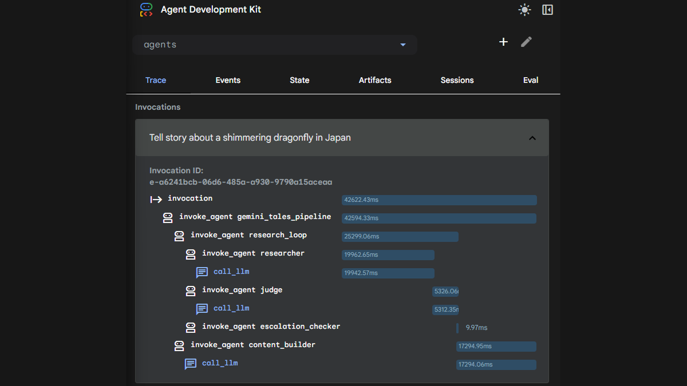

# ✨ Gemini Tales


> **Turning screen time into active adventure — A magical AI storyteller that sees, hears, and moves with your child.**

Gemini Tales is an interactive storytelling experience that blends real-time AI conversation with physical activity. Built with a modern **React + Vite** frontend, it leverages the **Gemini Live API** for magical conversation and vision, while a specialized **multi-agent backend** (built with Google ADK) works behind the scenes to research local legends, verify safety, and craft movement-based "Hero's Challenges."

---

## 🧚 The Experience: Live Storytelling

The frontend is a direct bridge to **Gemini 2.5 Flash Native Audio**, allowing for seamless, low-latency interaction.

| Feature | Magic Behind the Scenes |
|---|---|
| 🎙️ **Gemini Live Voice** | Interruption-aware, low-latency conversation. The child can speak or change the story path at any time. |
| 📸 **Visual Awareness** | The AI "sees" the child through the camera, reacting to their costumes, toys, or movement in real-time. |
| 🎨 **Dynamic Illustrations** | Watercolor-style art is generated as the story unfolds, reflecting the unique narrative of each child. |
| 🏆 **Developer Tools** | A built-in **Developer Control Center** allows for real-time debugging, chat logs, and media management. |

---

## 🤖 The Brain: Multi-Agent Story Engine

Our backend uses the **Google Agent Development Kit (ADK)** and the **A2A (Agent-to-Agent) protocol**, following the methodology of the [**"Optimize Agent Behavior"**](https://www.skills.google/paths/3545/course_templates/1564) course.

### 🎭 Meet the Agents

Each agent is engineered using the **5-pattern prompt architecture** (Identity, Mission, Methodology, Boundaries, and Few-shot Examples) to ensure maximum role-adherence and reliability.

| Agent |  Architecture Highlights | Performance Config |
|--|--|--|
| **Adventure Seeker** (Researcher) | Uses multi-step reasoning to plan physical activities. | **Gemini 2.5 Flash** + **BuiltInPlanner** (Temp 0.7). |
| **Guardian of Balance** (Judge) | Structured Output with strict validation. | **Gemini 2.5 Flash** + **Pydantic Schema** (Temp 0.1). |
| **Storysmith** (Builder) | Weaves research into immersive fantasy worlds. | **Gemini 2.5 Pro** for maximum literary quality (Temp 0.9). |

#### 1. 🔍 **Adventure Seeker** (The Researcher)
*   **Role:** World-class scout and pedagogy expert.
*   **Capability:** Uses `Google Search` to find magical facts about locations, local legends, and identifies safe physical exercises.
*   **Goal:** Gathers raw "adventure fuel" for the story.

#### 2. ⚖️ **Guardian of Balance** (The Judge)
*   **Role:** Senior safety officer and fitness expert.
*   **Capability:** Scans research for "passivity." If the content is too academic or lacks movement, it triggers a retry loop.
*   **Boundary:** Ensures every "Magic Task" is safe and appropriate for a 6-year-old.

#### 3. ✍️ **Storysmith** (The Content Builder)
*   **Role:** Award-winning children's author.
*   **Capability:** Weaves dry facts into a shimmering fantasy world.
*   **Goal:** Embeds **Hero's Challenges** (jumping, crawling, balancing) into the narrative structure.

### 🎼 Orchestration (The Continuous Refinement Loop)
The agents communicate over A2A in a loop to ensure high-quality output:
1.  **Orchestrator** triggers the **Adventure Seeker**.
2.  **Guardian of Balance** evaluates the findings (up to 3 times).
3.  If it fails (too boring/passive), the Seeker gets specific feedback and tries again.
4.  Once approved, the **Storysmith** crafts the final interactive script.



### 🛠️ Key Optimization Techniques Applied

-   **Full 5-Pattern Prompting**: Agent instructions include **Few-shot examples** to ensure predictable narrative and logic flows.
    
-   **Structured Output (Pydantic)**: The **Guardian of Balance** enforces a strict **BaseModel** schema, guaranteeing valid JSON with `pass`/`fail` status.
    
-   **Centralized Multi-Layer Safety**: All agents share a `STRICT_SAFETY` configuration, blocking harmful categories at the **BLOCK_LOW_AND_ABOVE** threshold.
    
-   **Reasoning-on-the-Fly**: The **Adventure Seeker** leverages **BuiltInPlanner** (budget: 1024) to analyze search results before generating exercises.
    
-   **Dynamic Temperament**: Individual `generate_content_config` settings, from deterministic logic (0.1) to creative storytelling (0.9).

---

## 🏗️ Architecture

For a detailed deep-dive into the system design, component responsibilities, and data flows, please refer to the [**ARCHITECTURE.md**](./ARCHITECTURE.md) document.

## 🚀 Getting Started

### Prerequisites

- **Python** 3.10+ & **Node.js** 18+
- **[uv](https://docs.astral.sh/uv/)** for lightning-fast backend management.
- **Google Cloud Project** with Vertex AI enabled.

### 1. Backend Launch
The backend runs five distributed services natively from the root: the App, three specialized agents, and an orchestrator.

#### **Easy Mode (Windows)**
The project includes a unified startup script that handles multi-service orchestration locally:

```powershell
# Starts all 5 services with automatic cleanup
.\run_local.ps1
```

This script:
- Synchronizes dependencies using `uv`.
- Launches all agent microservices on their respective ports.
- Starts the main API gateway.
- Provides a graceful shutdown (Ctrl+C) that terminates all child processes.

#### **Manual Launcher**
If you prefer manual control, use `uv` directly from the root:

```bash
# Configure project ID and location
cp .env.example .env 
uv sync

# Start leaf agents
uv run shared/adk_app.py agents/researcher --host 0.0.0.0 --port 8001 --a2a
uv run shared/adk_app.py agents/judge --host 0.0.0.0 --port 8002 --a2a
uv run shared/adk_app.py agents/content_builder --host 0.0.0.0 --port 8003 --a2a

# Start orchestrator and gateway
uv run shared/adk_app.py agents/orchestrator --host 0.0.0.0 --port 8004
uv run app/main.py
```

| Service | Port | Role |
|---|---|---|
| **Orchestrator** | `8004` | Controls the agent pipeline. |
| **Researcher** | `8001` | "Adventure Seeker" (Search Tool). |
| **Judge** | `8002` | "Guardian of Balance" (Consistency/Safety). |
| **Builder** | `8003` | "Storysmith" (Narrative Generation). |
| **Main App** | `8000` | FastAPI Proxy & React Static Host. |

Open http://localhost:8000 in your browser.

### 2. Deployment to Cloud Run

Gemini Tales is fully optimized for **Google Cloud Run**, leveraging its serverless scale and secure service-to-service communication.

#### **Automated Deployment (Recommended)**
The fastest way to deploy all 5 services is to use the provided PowerShell script:

```powershell
# Deploy all agents, orchestrator, and frontend
.\deploy.ps1
```

This script handles:
- **Environment Management**: Loading your `.env` configuration.
- **Dependency Preparation**: Copying shared logic and safety settings into each agent's build context.
- **Service Mesh**: Dynamically linking researchers, judges, and builders to the orchestrator.
- **Security**: Setting up authenticated internal communication and public frontend access.

#### **Deployed Services Architecture**
| Service | Access Level | Description |
|---|---|---|
| `gemini-tales` | **Public** | Main web frontend (React) and A2A gateway. |
| `orchestrator` | Private | The master controller for agent missions. |
| `researcher` | Private | High-speed data gathering via Google Search. |
| `judge` | Private | Content validation and safety enforcement. |
| `content-builder` | Private | Narrative generation and story crafting. |

---

## 🛠️ Tech Stack

-   **Frontend**: **React**, **Vite**, and **Tailwind CSS**. A modern, responsive UI with glassmorphism effects and real-time state management.

-   **Cloud Infrastructure**: **Google Cloud Run**. Serverless hosting for high-availability and secure agentic microservices.

-   **Intelligence & Reasoning**: **Gemini 2.5 Flash & Pro** via **Google AI Studio** & **Vertex AI (Google Cloud)**. Featuring **Gemini Live** for immersive voice/vision.
    
-   **Agentic Ecosystem**: **Google ADK (Agent Development Kit)**. The core framework for our autonomous agent personas.
    
-   **Development & Debugging**: **Antigravity (IDE)**. Our agentic development platform, evolving the IDE for the agent-first era. Used for agent visualization, cross-surface control (editor, terminal, browser), and real-time monitoring of agent missions.

-   **Communication Protocol**: **Agent-to-Agent (A2A)** and a **FastAPI Proxy** for WebSocket communication.
    
-   **Validation & Reliability**: **Pydantic** for structured data output and **Gemini Safety Settings** for strict content filtering (BLOCK_LOW_AND_ABOVE).
    
-   **Runtime & Environments**: **Python 3.10+**, **FastAPI**, and **uv** for high-performance backend management.

---

## 📜 License

MIT — see [LICENSE](LICENSE).

*Created with ❤️ for the next generation of explorers by [Veronika Kashtanova](https://x.com/veron_code)*
